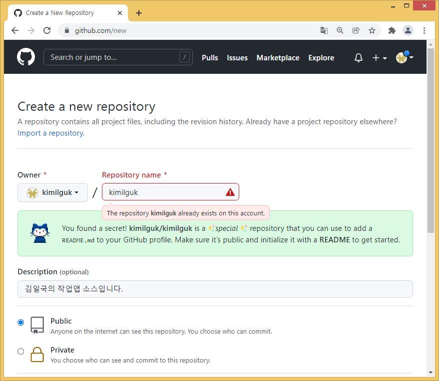
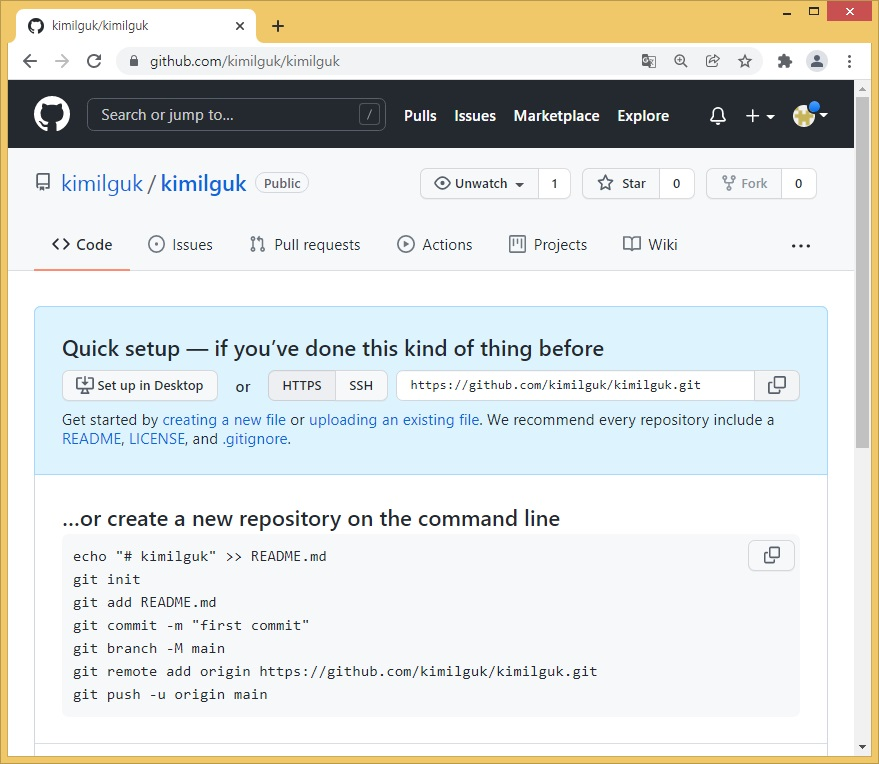
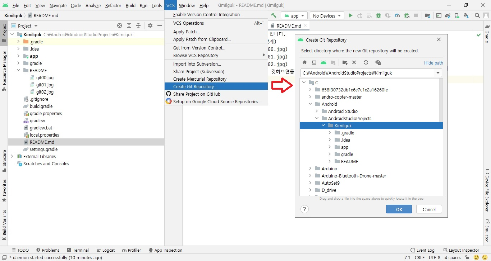
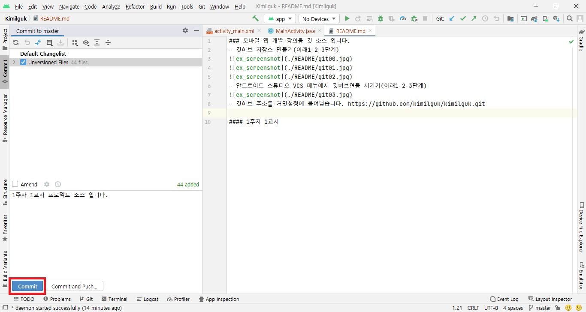
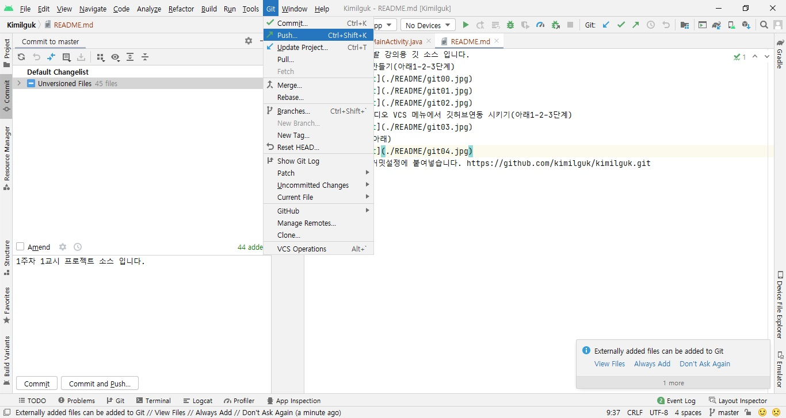
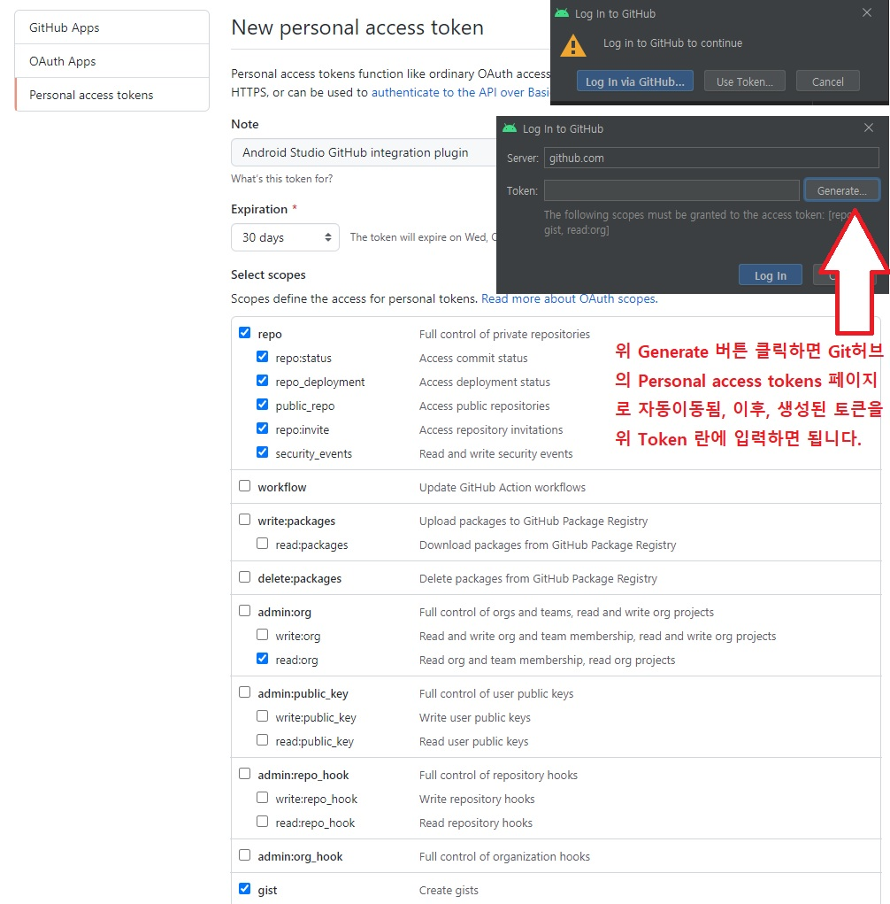

### 모바일 앱 개발 강의용 깃 소스 입니다.
#### [1주차 1교시](https://github.com/kimilguk/kimilguk/tree/master)
- 깃허브 저장소 만들기(아래1-2-3단계)

- 안드로이드 스튜디오 VCS 메뉴에서 깃허브연동 시키기(아래1-2-3단계)

- 로컬PC에 커밋(아래)

- 원격 깃허브에 푸시(아래)

- 깃허브 주소를 커밋설정에 붙여넣습니다. https://github.com/kimilguk/kimilguk.git
- useToken 사용(안드로이드 스튜디오 로그인창에서 Generate 버튼 필요) 로그인 후 푸시처리 됩니다.
